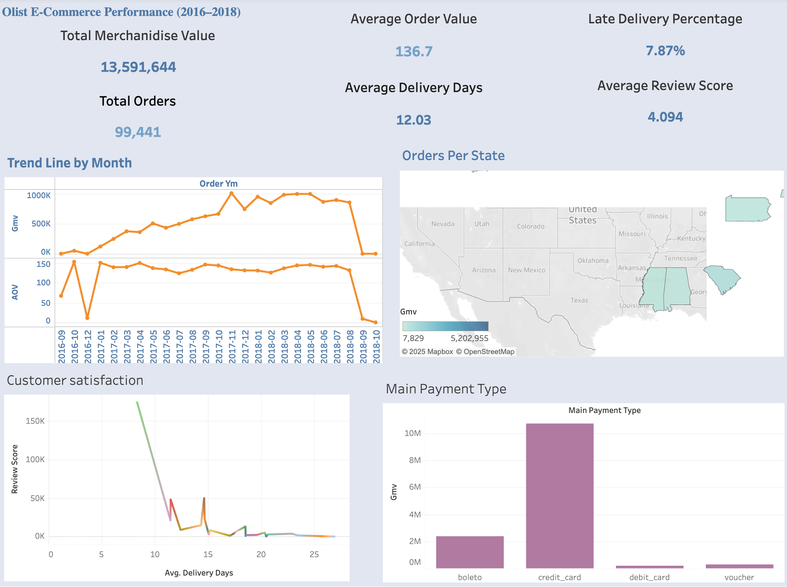

# 🛍️ Olist E-Commerce Analytics Dashboard

**Author:** Mohammed Suhayl Dastager  
**Tools:** Tableau Public, Python (Pandas), Google Colab  
**Dataset:** [Brazilian E-Commerce Public Dataset by Olist](https://www.kaggle.com/datasets/olistbr/brazilian-ecommerce)

---

## 📊 Project Overview

This project analyzes **100K+ online orders** from the Brazilian e-commerce platform **Olist** (2016–2018).  
Using Tableau, I built an **interactive business analytics dashboard** that provides insights into:

- **Sales Performance (GMV, AOV, Orders)**
- **Delivery Efficiency (Delivery Days, Late Deliveries)**
- **Customer Satisfaction (Review Scores)**
- **Payment Methods & Regional Trends**

---

## Objectives

- Transform raw transactional data into a single **business-ready fact table** using Python.  
- Build **key performance indicators (KPIs)** and interactive visualizations in Tableau.  
- Identify growth opportunities and operational inefficiencies.  
- Showcase end-to-end analytics workflow from **data cleaning → visualization → insights**.

---

## Data Cleaning & Preparation

Performed in **Google Colab** using **Pandas**:
- Merged multiple Olist tables (orders, items, payments, reviews, customers)
- Created metrics:
  - `gmv` (Gross Merchandise Value)
  - `aov` (Average Order Value)
  - `delivery_days`, `delivered_late`, `review_score`
- Removed nulls, standardized datatypes, exported as `olist_orders_fact_clean.csv`.

---

## 📈 Tableau Dashboard

🔗 **Live Dashboard on Tableau Public:**  
[👉 View Dashboard](https://public.tableau.com/views/Book1_17604481631990/OlistE-CommercePerformance20162018?:language=en-GB&:sid=&:redirect=auth&publish=yes&showOnboarding=true&:display_count=n&:origin=viz_share_link) 

**Main Visuals:**
1. **KPI Row:** GMV, Orders, AOV, Delivery Days, Late Delivery Rate, Review Score  
2. **Monthly GMV Trend:** Sales growth and seasonality  
3. **Regional Performance:** GMV and CSAT by state  
4. **Delivery vs Review Scatter:** How delays impact customer satisfaction  
5. **Payment Method Breakdown:** Distribution of sales and AOV by payment type

---

## Key Business Insights

- **Delivery Time vs Satisfaction:** Each additional day of delay decreases average review score by ~0.3.  
- **Regional Opportunity:** Southeast Brazil leads in GMV, but has the highest late-delivery rate.  
- **Payments:** Credit card payments dominate with highest AOV.  
- **Growth:** GMV increased steadily from mid-2017 with clear holiday peaks.

---

## ⚙️ Tech Stack

| Tool | Purpose |
|------|----------|
| Python (Pandas) | Data cleaning & preparation |
| Tableau Public | Dashboard creation & storytelling |
| GitHub | Portfolio & version control |
| Kaggle | Dataset source |

---

## Dashboard Preview

---

## Results & Learnings

- Developed an **end-to-end analytics workflow** connecting data science and business intelligence.  
- Practiced **KPI design, dashboard layout, and storytelling** in Tableau.  
- Gained hands-on experience in **retail data analytics** and performance optimization.

---

## 📂 Repository Structure
